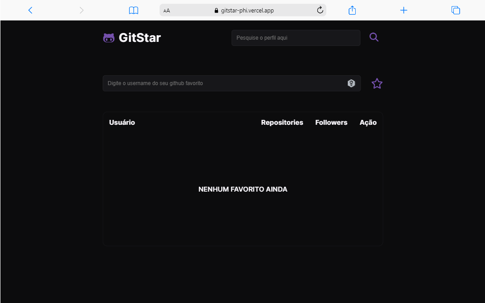

# Aplicação GitStar para favoritar perfis do github.

Este projeto tem como objetivo facilitar a gestão de perfis favoritos do GitHub, proporcionando aos usuários uma forma eficiente de adicionar e organizar perfis de interesse. A aplicação GitStar que desenvolvemos oferece uma interface personalizável para ajudar os usuários a manterem uma lista de perfis favoritos, tornando mais fácil acompanhar as atividades e contribuições desses perfis na plataforma GitHub.

## Stack utilizada

**Front-end:** HTML, CSS e JS

## Deploy

[LINK](https://gitstar-phi.vercel.app/).

## Screenshots

## Gif

